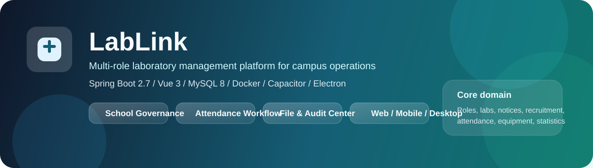
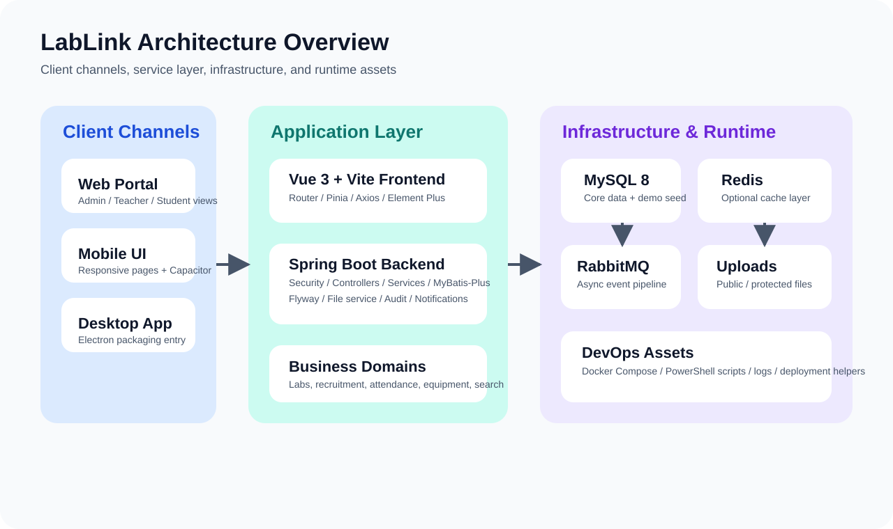
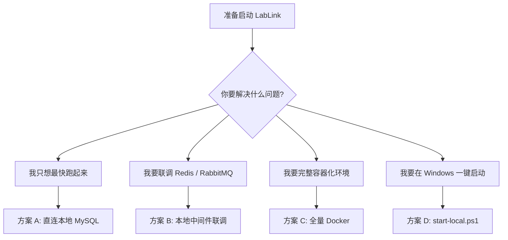

<p align="center">
  
</p>

# LabLink 实验室管理平台

面向高校实验室治理、招新协作、考勤管理、文件流转和统计分析的一体化全栈平台。仓库内同时包含后端服务、Web 前端、移动端适配、桌面端打包入口，以及本地联调与部署脚本。

项目当前已经落地学校版场景。如需了解学校版改造背景和范围，见 [AIIT-SCHOOL-EDITION.md](docs/AIIT-SCHOOL-EDITION.md)。

<a id="toc"></a>
## 目录

- [项目概览](#overview)
- [系统架构](#architecture)
- [能力地图](#capability-map)
- [技术栈](#tech-stack)
- [仓库结构](#repo-structure)
- [启动方案选择](#startup-guide)
- [环境准备](#environment)
- [本地开发与启动](#run-local)
- [配置说明](#configuration)
- [常用命令](#commands)
- [联调账号与文档索引](#accounts-and-docs)
- [常见问题](#faq)
- [开发与维护建议](#maintenance)

<a id="overview"></a>
## 项目概览

LabLink 主要解决高校实验室管理里的四类问题：

- 组织治理：学校、学院、实验室三级权限和数据范围控制
- 协作流转：教师注册审批、实验室创建审批、成员加入与退出
- 日常运营：公告、通知、实验室空间、文件上传、审计日志
- 业务闭环：考勤任务、签到码 / 二维码、请假、补签、搜索、统计导出

### 一页速览

| 维度 | 内容 |
| --- | --- |
| 适用场景 | 高校实验室管理、教学实验中心、学院实验室运营 |
| 核心角色 | 学校管理员、学院管理员、实验室负责人、教师、学生 |
| 主要客户端 | Web、移动端适配、Electron 桌面端、Capacitor Android |
| 核心后端 | Spring Boot 2.7 + Spring Security + MyBatis-Plus + Flyway |
| 核心前端 | Vue 3 + Vite + Element Plus + Pinia + Axios |
| 数据层 | MySQL 8，按需启用 Redis / RabbitMQ |
| 默认后端端口 | `8081` |
| 默认前端开发端口 | `3000` |

### 典型使用流程

1. 学校或学院管理员维护组织与权限。
2. 教师提交注册申请，或发起实验室创建 / 招新计划。
3. 学生浏览实验室、提交申请、完善个人资料。
4. 实验室负责人进行成员管理、文件协作、考勤签到。
5. 平台统一沉淀通知、审计、搜索和统计分析结果。

<a id="architecture"></a>
## 系统架构



### 架构说明

- 前端层：`frontend/` 同时承载 Web、移动端适配、Electron 桌面端入口。
- 后端层：`src/main/java/` 采用 Spring Boot 单体架构，按 controller / service / mapper / entity / dto 划分。
- 数据层：MySQL 为核心持久化；Redis 与 RabbitMQ 通过配置开关按需启用。
- 运行资产：普通上传目录、受控上传目录、日志目录、判题工作目录均支持独立配置。
- 运维入口：提供 `docker-compose.local.yml`、`docker-compose.cloud.yml` 和多份 PowerShell / Shell 脚本。

### 启动方案选择图



<a id="capability-map"></a>
## 能力地图

### 按角色划分

| 角色 | 主要职责 | 典型功能 |
| --- | --- | --- |
| 学校管理员 | 全校范围治理 | 学院管理、全局统计、账号治理、跨学院配置 |
| 学院管理员 | 学院范围治理 | 实验室审批、教师申请审核、学院维度统计 |
| 实验室负责人 | 实验室运营 | 成员管理、招新计划、实验室档案、考勤任务 |
| 教师 | 教学与协作 | 参与实验室管理、查看运营数据、跟进审批 |
| 学生 | 申请与参与 | 浏览实验室、提交申请、签到、查看通知与资料 |

### 按业务域划分

| 业务域 | 当前能力 | 说明 |
| --- | --- | --- |
| 组织与权限 | 学校 / 学院 / 实验室三级数据范围 | 权限与数据范围联动 |
| 实验室治理 | 实验室档案、负责人管理、成员流转 | 支持创建审批与信息维护 |
| 招新与申请 | 成员申请、教师注册申请、实验室创建申请 | 覆盖提交流程与审核流程 |
| 日常运营 | 公告、通知、审计日志、实验室空间、文件上传 | 包含普通与受控文件 |
| 考勤管理 | 任务、排班、签到、请假、补签、状态修正 | 同时保留旧接口兼容处理 |
| 数据能力 | 搜索中心、统计分析、导出 | 覆盖多角色看板与维度查询 |
| 扩展模块 | 设备管理、论坛、成长中心、笔试 | 其中部分模块按开关启用 |

### 可选模块开关

默认关闭，可在 [src/main/resources/application.yml](src/main/resources/application.yml) 或环境变量中启用：

- `app.modules.forum.enabled`
- `app.modules.growth-center.enabled`
- `app.modules.written-exam.enabled`

<a id="tech-stack"></a>
## 技术栈

| 层次 | 技术 |
| --- | --- |
| 后端 | Java 11、Spring Boot 2.7、Spring Security、MyBatis-Plus、Flyway |
| 前端 | Vue 3、Vite、Element Plus、Pinia、Axios |
| 数据库 | MySQL 8 |
| 可选中间件 | Redis、RabbitMQ |
| 构建工具 | Maven、npm |
| 桌面 / 移动 | Electron、Capacitor |
| 部署方式 | 本地运行、Docker Compose、本地 / 云端脚本 |

### 核心配置文件

- 后端配置：[src/main/resources/application.yml](src/main/resources/application.yml)
- 前端开发代理：[frontend/vite.config.js](frontend/vite.config.js)
- Docker 本地编排：[docker-compose.local.yml](docker-compose.local.yml)
- Docker 云端编排：[docker-compose.cloud.yml](docker-compose.cloud.yml)
- 本地环境模板：[.env.local.example](.env.local.example)
- 云端环境模板：[.env.cloud.example](.env.cloud.example)

<a id="repo-structure"></a>
## 仓库结构

```text
.
├─ src/                          后端源码
│  ├─ main/java/                controller / service / mapper / entity / dto
│  └─ main/resources/           application.yml、Flyway 脚本、mapper XML、init.sql
├─ frontend/                     Vue 前端、多端适配、Electron / Capacitor 入口
│  ├─ src/
│  ├─ electron/
│  └─ public/
├─ docs/                         项目文档、演示脚本、启动说明
├─ scripts/                      本地启动、修复、部署、联调脚本
├─ backup/                       数据库备份与辅助 SQL
├─ deploy-tools/                 部署辅助工具
├─ docker-compose.local.yml      本地联调 / 本地全量容器
├─ docker-compose.cloud.yml      云端部署
├─ Dockerfile.backend            后端镜像构建文件
├─ application.yml               根目录备用配置
└─ README.md                     当前说明文档
```

### 目录说明

- `src/main/resources/init.sql`：完整初始化 SQL，适合首次导入演示数据。
- `src/main/resources/db/migration/`：Flyway 增量迁移脚本，适合结构演进。
- `frontend/src/views/`：按角色和终端拆分的页面目录。
- `frontend/src/api/`：前端接口封装。
- `scripts/`：包含 Windows 和 Linux 的启动、部署、修复脚本。

<a id="startup-guide"></a>
## 启动方案选择

| 方案 | 适用场景 | 是否推荐 | 说明 |
| --- | --- | --- | --- |
| 方案 A：直连本地 MySQL | 只想快速跑通前后端 | 推荐 | 最短路径，适合开发调试 |
| 方案 B：本地中间件联调 | 需要验证 Redis / RabbitMQ | 推荐 | 更接近完整环境 |
| 方案 C：全量 Docker | 需要完整容器化运行 | 推荐 | 前后端与中间件一起启动 |
| 方案 D：Windows 一键脚本 | Windows 本地快速拉起 | 条件推荐 | 适合本地演示或临时调试 |

<a id="environment"></a>
## 环境准备

### 基础要求

- `JDK 11+`
- `Maven 3.6+`
- `Node.js 18+`
- `MySQL 8.x`
- `Docker Desktop`（仅在需要容器化或联调中间件时）

### 数据库初始化方式

#### 方式 1：空库启动，交给 Flyway 管理结构

适合日常开发。

```sql
CREATE DATABASE lab_recruitment
  DEFAULT CHARACTER SET utf8mb4
  COLLATE utf8mb4_unicode_ci;
```

说明：

- 后端启动后会根据 [src/main/resources/db/migration/](src/main/resources/db/migration/) 自动执行迁移。
- 这种方式可以完成基础结构初始化，但不一定包含完整演示数据。

#### 方式 2：导入完整初始化 SQL

适合需要固定演示数据、联调账号和完整业务样例的场景。

```powershell
mysql -uroot -p lab_recruitment < src/main/resources/init.sql
```

说明：

- [src/main/resources/init.sql](src/main/resources/init.sql) 包含完整表结构与初始化内容。
- `docker-compose.local.yml` 在第一次初始化 MySQL 数据卷时会自动挂载并执行该文件。
- 如果 Docker 数据卷已经存在，再次 `up` 不会重复导入，需要手动清理数据卷或手动导入。

### 最低必配环境变量

```powershell
$env:DB_URL='jdbc:mysql://localhost:3306/lab_recruitment?useUnicode=true&characterEncoding=utf-8&useSSL=false&serverTimezone=GMT%2B8&allowPublicKeyRetrieval=true'
$env:DB_USERNAME='root'
$env:DB_PASSWORD='你的数据库密码'
$env:JWT_SECRET='请替换成至少 32 位的密钥'
```

<a id="run-local"></a>
## 本地开发与启动

说明：

- 下文命令默认在仓库根目录 `lab/` 执行。
- PowerShell 命令以 Windows 环境为例。
- 如果你只做前后端开发，Docker 不是必需；如果你要验证缓存、消息链路或完整容器环境，再启用 Docker。

### 方案 A：直连本地 MySQL

1. 创建数据库，或手动导入 `init.sql`。
2. 设置必要环境变量。
3. 启动后端：

```powershell
mvn spring-boot:run
```

如果需要先打包再启动：

```powershell
mvn -DskipTests clean package
java -jar target/lab-recruitment-1.0.0.jar
```

4. 启动前端：

```powershell
Set-Location frontend
npm install
npm run dev
```

5. 访问服务：

- 前端：`http://localhost:3000`
- 后端：`http://localhost:8081`

补充说明：

- 前端开发服务器会将 `/api` 和 `/uploads` 代理到后端。
- 若你使用空库启动，首次启动时间会略长，因为 Flyway 需要执行迁移。

### 方案 B：本地中间件联调

适合需要 Redis、RabbitMQ 或想模拟完整依赖栈的场景。

1. 准备环境文件：

```powershell
Copy-Item .env.local.example .env.local
```

2. 启动中间件：

```powershell
docker compose --env-file .env.local -f docker-compose.local.yml up -d mysql redis rabbitmq
```

3. 启动后端：

```powershell
mvn spring-boot:run
```

4. 启动前端：

```powershell
Set-Location frontend
npm install
npm run dev
```

默认端口：

| 服务 | 端口 |
| --- | --- |
| MySQL | `3307` |
| Redis | `6379` |
| RabbitMQ | `5672` |
| RabbitMQ 管理台 | `15672` |
| 后端 | `8081` |
| 前端开发服务器 | `3000` |

### 方案 C：全量 Docker

适合希望直接运行完整容器化环境的场景。该方式会同时启动 MySQL、Redis、RabbitMQ、后端和前端。

1. 准备环境文件：

```powershell
Copy-Item .env.local.example .env.local
```

2. 启动完整环境：

```powershell
docker compose --env-file .env.local -f docker-compose.local.yml up -d --build
```

3. 访问服务：

- 前端：`http://localhost`
- 后端：`http://localhost:8081`
- MySQL：`localhost:3307`

说明：

- Docker 本地编排的前端容器默认暴露 `80` 端口。
- 第一次初始化 MySQL 时会自动执行 `init.sql`。

### 方案 D：Windows 一键启动脚本

仓库中提供了面向 Windows 的本地启动脚本：

```powershell
Copy-Item .env.cloud.example .env.cloud
powershell -ExecutionPolicy Bypass -File .\scripts\start-local.ps1
```

注意：

- 当前 `scripts/start-local.ps1` 读取的是 `.env.cloud`，不是 `.env.local`。
- 脚本会拉起本地所需服务，并尝试启动前后端。
- 如果本地没有 `target/lab-recruitment-1.0.0.jar`，脚本可能触发 Maven 构建。

<a id="configuration"></a>
## 配置说明

### 核心环境变量

| 变量名 | 是否必需 | 默认值 | 说明 |
| --- | --- | --- | --- |
| `SERVER_PORT` | 否 | `8081` | 后端端口 |
| `DB_URL` | 是 | `jdbc:mysql://localhost:3306/lab_recruitment...` | 数据库连接串 |
| `DB_USERNAME` | 是 | `root` | 数据库用户名 |
| `DB_PASSWORD` | 是 | 配置文件中存在本地开发默认值 | 生产环境必须显式覆盖 |
| `JWT_SECRET` | 是 | 无 | JWT 密钥 |
| `APP_SCHEMA_MIGRATION_ENABLED` | 否 | `true` | 是否启用 Flyway 迁移 |
| `APP_SCHEMA_RUNTIME_UPDATE_ENABLED` | 否 | `false` | 是否启用运行时结构修复 |
| `LABLINK_CACHE_REDIS_ENABLED` | 否 | `false` | 是否启用 Redis 缓存 |
| `LABLINK_MQ_RABBIT_ENABLED` | 否 | `false` | 是否启用 RabbitMQ 消息链路 |
| `FILE_UPLOAD_PATH` | 否 | `./uploads/` | 普通上传目录 |
| `FILE_PROTECTED_UPLOAD_PATH` | 否 | `./uploads_protected/` | 受控上传目录 |
| `MAIL_USERNAME` | 否 | 空 | 邮件账号 |
| `MAIL_PASSWORD` | 否 | 空 | SMTP 授权码 |

### 模块开关

| 配置项 | 默认值 | 说明 |
| --- | --- | --- |
| `app.modules.forum.enabled` | `false` | 论坛模块 |
| `app.modules.growth-center.enabled` | `false` | 成长中心模块 |
| `app.modules.written-exam.enabled` | `false` | 笔试模块 |
| `app.search.notice-fulltext-enabled` | `true` | 公告全文搜索 |

### 端口与运行目录

| 项目 | 默认值 | 说明 |
| --- | --- | --- |
| 后端端口 | `8081` | `server.port` |
| 前端开发端口 | `3000` | `vite` 默认开发端口 |
| Docker 前端端口 | `80` | `docker-compose.local.yml` |
| 日志目录 | `logs/` | 后端日志输出 |
| 普通上传目录 | `uploads/` | 对外可访问文件 |
| 受控上传目录 | `uploads_protected/` | 需要权限校验的文件 |
| 判题工作目录 | `./.judge-work` | 笔试 / 判题临时目录 |

### 推荐做法

- 团队协作时优先维护 `.env.local.example` 与 `.env.cloud.example`。
- 不要在 README 或脚本中写死真实密钥。
- 数据结构变更优先通过 Flyway 迁移落地，不要只改本地数据库。

<a id="commands"></a>
## 常用命令

### 后端

```powershell
mvn -DskipTests clean package
mvn -q test
mvn spring-boot:run
```

### 前端

```powershell
Set-Location frontend
npm install
npm run dev
npm run build
npm run preview
```

### 桌面端

```powershell
Set-Location frontend
npm run desktop:start
npm run desktop:dist
```

### Android

```powershell
Set-Location frontend
npm run build
npm run android:add
npm run android:sync
npm run android:open
```

### Docker

```powershell
docker compose --env-file .env.local -f docker-compose.local.yml up -d
docker compose --env-file .env.cloud -f docker-compose.cloud.yml up -d --build
```

<a id="accounts-and-docs"></a>
## 联调账号与文档索引

### 联调账号

固定管理账号说明见 [MANAGEMENT_ACCOUNTS.md](docs/MANAGEMENT_ACCOUNTS.md)。

本地联调建议优先使用：

- `superadmin`
- `cs_admin`
- `ai_admin`
- `ee_admin`
- `me_admin`
- `mgt_admin`
- `art_admin`
- `fla_admin`

默认密码通常为：

- `Lab123456`

说明：

- 管理账号属于固定种子账号，用户名不建议改动。
- 若你使用的是空库 + Flyway 方式，演示账号可能不存在，此时请手动导入 `init.sql`。

### 文档索引

| 文档 | 用途 |
| --- | --- |
| [STARTUP.md](docs/STARTUP.md) | 最简启动说明 |
| [IDEA-LOCAL-RUN.md](docs/IDEA-LOCAL-RUN.md) | IDEA 本地运行与中间件联调 |
| [LOCAL-MIDDLEWARE.md](docs/LOCAL-MIDDLEWARE.md) | 本地 MySQL / Redis / RabbitMQ 使用说明 |
| [DB-BOOTSTRAP.md](docs/DB-BOOTSTRAP.md) | 数据库初始化与引导 |
| [Desktop_Android_Development_Guide.md](docs/Desktop_Android_Development_Guide.md) | 桌面端与 Android 开发 |
| [FLYWAY-MIGRATION-FIX.md](docs/FLYWAY-MIGRATION-FIX.md) | Flyway 迁移修复 |
| [AIIT-SCHOOL-EDITION.md](docs/AIIT-SCHOOL-EDITION.md) | 学校版背景与范围 |
| [DEMO-SCRIPT.md](docs/DEMO-SCRIPT.md) | 演示流程脚本 |
| [DEFENSE_VIDEO_SCRIPT.md](docs/DEFENSE_VIDEO_SCRIPT.md) | 答辩视频脚本 |
| [WORK_DEMO_VIDEO_SCRIPT.md](docs/WORK_DEMO_VIDEO_SCRIPT.md) | 工作演示视频脚本 |

<a id="faq"></a>
## 常见问题

### 1. 后端启动时报 Flyway 或数据库连接错误

优先检查：

- `DB_URL`、`DB_USERNAME`、`DB_PASSWORD` 是否正确
- 数据库 `lab_recruitment` 是否已经创建
- `APP_SCHEMA_MIGRATION_ENABLED` 是否被错误关闭

如果是旧库残留 Flyway 失败记录，参考 [FLYWAY-MIGRATION-FIX.md](docs/FLYWAY-MIGRATION-FIX.md)。

### 2. 前端能打开，但接口返回 401 / 404

优先检查：

- 后端是否已启动在 `8081`
- [frontend/vite.config.js](frontend/vite.config.js) 中代理目标是否可达
- 当前登录态 token 是否失效
- Docker 模式下前端是否访问了正确的端口

### 3. Redis / RabbitMQ 是不是必须启用

不是必须。

- 核心业务流程可在关闭 Redis / RabbitMQ 的情况下运行。
- 只有在验证缓存、消息通知、异步链路时才建议启用。

### 4. 为什么我启动成功了，但没有演示账号

通常有两种原因：

- 你使用的是空库 + Flyway，仅创建了结构，没有导入完整演示数据。
- 你之前已经初始化过 Docker MySQL 数据卷，`init.sql` 不会再次自动执行。

解决方式：

- 手动导入 [src/main/resources/init.sql](src/main/resources/init.sql)
- 或清理 MySQL 数据卷后重新初始化

### 5. `docker-compose.local.yml` 和 `docker-compose.cloud.yml` 怎么选

- `docker-compose.local.yml`：用于本地联调、本地完整容器环境
- `docker-compose.cloud.yml`：用于服务器 / 云端部署

### 6. Windows 一键启动脚本为什么读取 `.env.cloud`

当前仓库里的 `scripts/start-local.ps1` 设计就是读取 `.env.cloud`。如果你准备用它拉起本地环境，请先复制云端模板，再按本机情况调整配置。

<a id="maintenance"></a>
## 开发与维护建议

- 不要提交 `.env.*`、`temp-*.log`、运行时产物、数据库快照和本地测试文件。
- 数据库结构变更优先通过 Flyway 迁移维护。
- 前端接口改动后，优先同步检查：
  - `frontend/src/api/`
  - `frontend/src/utils/request.js`
  - 对应页面与状态管理代码
- 对考勤、权限、实验室治理等核心链路，建议每次改动后至少回归以下路径：
  - `auth/login`
  - `auth/me`
  - 创建签到
  - 学生签到
  - 结束签到
  - 同日再次创建签到
  - 实验室申请 / 审批
  - 通知中心读取

如果你是第一次接手这个仓库，建议阅读顺序：

1. 本 README
2. [STARTUP.md](docs/STARTUP.md)
3. [IDEA-LOCAL-RUN.md](docs/IDEA-LOCAL-RUN.md)
4. [MANAGEMENT_ACCOUNTS.md](docs/MANAGEMENT_ACCOUNTS.md)
5. 与当前任务相关的专项文档
