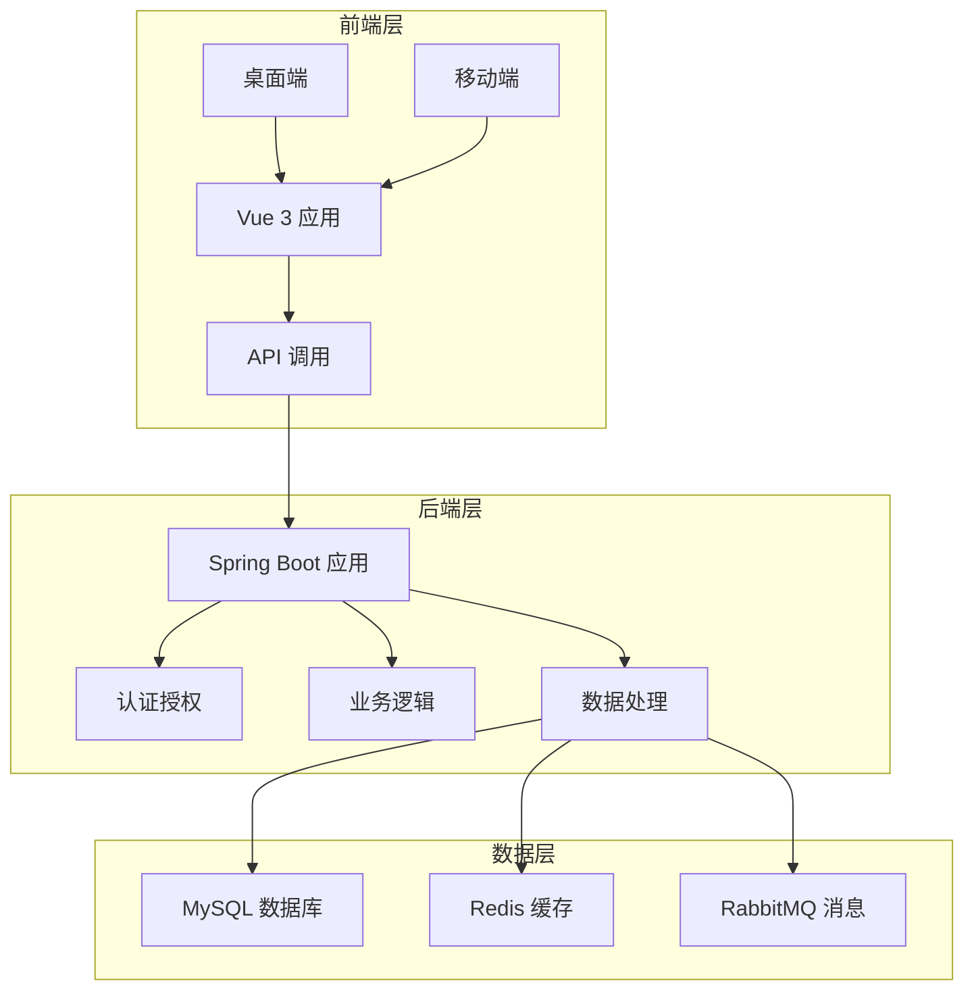
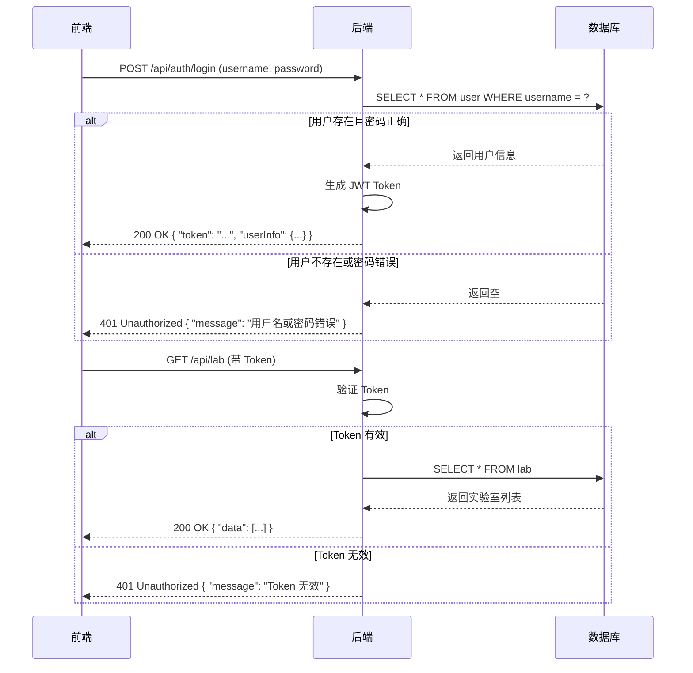
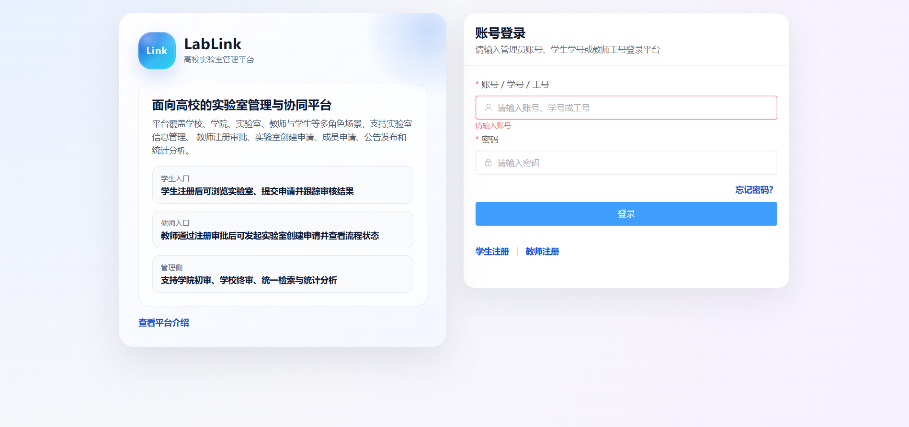
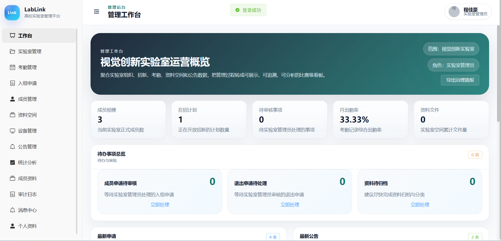
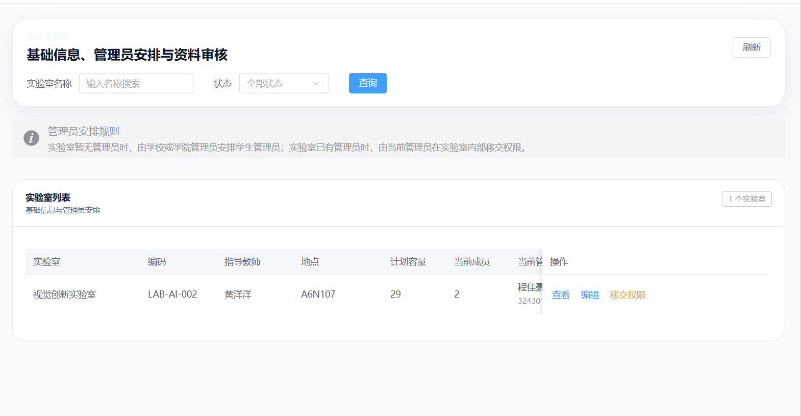
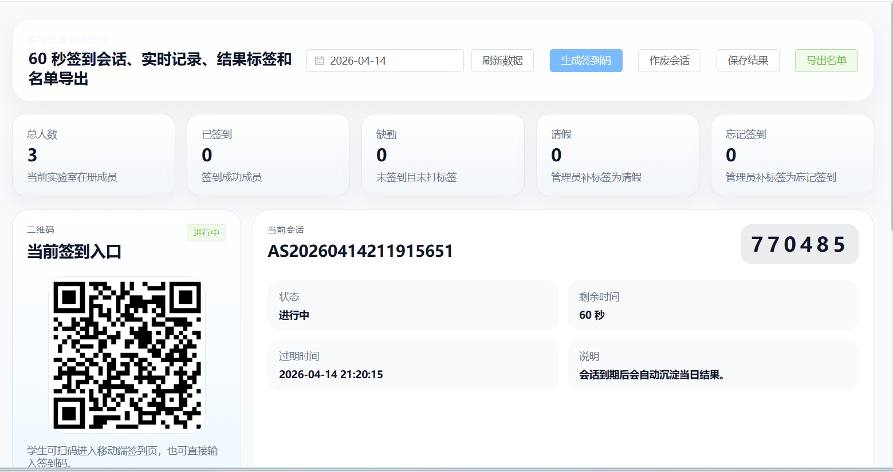
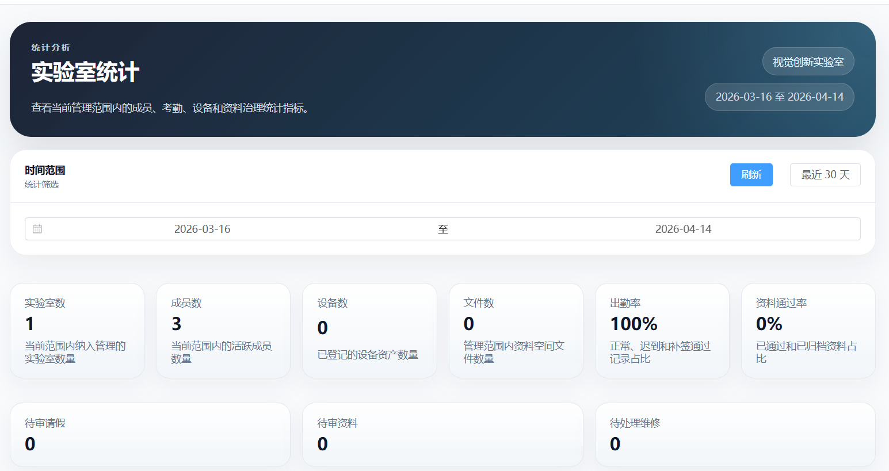

# 计算机软件著作权登记申请

## 软件名称：LabLink 实验室管理平台

### 版本号：V1.0.0

### 开发完成日期：2026年04月14日

### 开发单位：LabLink 开发团队

---

## 目录

1. 软件简介
   1.1 开发背景
   1.2 软件介绍
   1.3 面向用户
   1.4 主要功能
   1.5 优势创新
2. 运行环境
   2.1 硬件要求
   2.2 软件环境
3. 软件技术
   3.1 技术栈
   3.2 架构设计
   3.3 数据模型
4. 功能模块
   4.1 认证与授权模块
   4.2 实验室管理模块
   4.3 成员管理模块
   4.4 考勤管理模块
   4.5 资料管理模块
   4.6 统计分析模块
5. 界面截图
6. 操作说明
   6.1 管理员操作指南
   6.2 教师操作指南
   6.3 学生操作指南
7. 总结

---

## 1. 软件简介

### 1.1 开发背景

随着高校实验室规模的不断扩大和管理需求的日益复杂，传统的实验室管理方式已经难以满足现代高校的管理需求。人工管理方式存在效率低下、信息不透明、数据统计困难等问题，严重影响了实验室的运行效率和管理质量。

为了解决这些问题，我们开发了 LabLink 实验室管理平台，旨在通过信息化手段优化实验室管理流程，提高管理效率，为学校、学院、实验室、教师和学生提供便捷的管理工具。

### 1.2 软件介绍

LabLink 实验室管理平台是一款面向高校实验室场景的全栈管理系统，基于 Java 和 Vue 技术栈开发，支持桌面端和移动端访问。系统采用分层架构设计，具有良好的可扩展性和可维护性。

平台覆盖了实验室管理的全流程，包括实验室档案管理、成员管理、考勤管理、资料管理、统计分析等功能，为不同角色的用户提供了定制化的操作界面和功能。

### 1.3 面向用户

本软件面向以下用户群体：
- **学校管理员**：负责学校层面的实验室管理和统筹
- **学院管理员**：负责学院层面的实验室管理和审批
- **实验室负责人**：负责实验室的日常运营和管理
- **教师**：参与实验室指导和管理
- **学生**：参与实验室活动和学习

### 1.4 主要功能

1. **多角色权限体系**：支持学校、学院、实验室、教师、学生等多种角色，实现精细化权限控制
2. **实验室档案与创建审批**：支持实验室信息管理、创建申请与审批流程
3. **成员管理**：支持成员加入、退出、角色管理等功能
4. **个人资料与简历材料管理**：支持用户个人信息维护和材料上传
5. **实验室空间、公告、通知、审计**：提供实验室内部管理工具
6. **考勤与签到**：支持管理端、学生端、移动端签到，支持签到码/二维码
7. **统计分析与导出能力**：提供数据统计和报表导出功能

### 1.5 优势创新

1. **多端适配**：支持桌面端和移动端，满足不同场景的使用需求
2. **精细化权限控制**：基于角色的权限管理，确保数据安全和操作权限的合理分配
3. **流程化审批**：标准化的审批流程，提高管理效率和透明度
4. **数据可视化**：直观的数据统计和分析功能，为决策提供支持
5. **安全性**：采用 JWT 认证和 BCrypt 密码加密，确保系统安全
6. **可扩展性**：模块化设计，便于功能扩展和系统升级

---

## 2. 运行环境

### 2.1 硬件要求

- **服务器**：
  - CPU：Intel Core i5 或 equivalent
  - 内存：8GB 以上
  - 存储空间：50GB 以上
  - 网络：稳定的网络连接

- **客户端**：
  - 桌面端：普通办公电脑即可
  - 移动端：支持 Android 6.0 及以上版本

### 2.2 软件环境

- **服务器**：
  - 操作系统：Windows Server 2016 或 Linux
  - JDK：Java 11 及以上
  - 数据库：MySQL 8.0 及以上
  - 可选中间件：Redis 6.0+、RabbitMQ 3.8+

- **前端**：
  - 浏览器：Chrome 90+、Firefox 88+、Edge 90+
  - 移动端：Android 6.0+、iOS 13.0+

---

## 3. 软件技术

### 3.1 技术栈

- **后端**：Java 11、Spring Boot 2.7、Spring Security、MyBatis-Plus、Flyway
- **前端**：Vue 3、Vite、Element Plus、Pinia、Axios
- **数据库**：MySQL 8
- **可选中间件**：Redis、RabbitMQ
- **构建工具**：Maven、npm
- **移动/桌面**：Capacitor、Electron

### 3.2 架构设计

#### 系统架构图

#### 核心流程图

### 3.3 数据模型

#### 核心数据实体

1. **用户 (User)**
   - id: 主键
   - username: 账号
   - password: 密码（加密存储）
   - name: 姓名
   - role: 角色
   - collegeId: 所属学院
   - labId: 所属实验室
   - managedLabId: 管理的实验室

2. **实验室 (Lab)**
   - id: 主键
   - name: 实验室名称
   - collegeId: 所属学院
   - managerId: 负责人
   - description: 描述
   - status: 状态

3. **实验室成员 (LabMember)**
   - id: 主键
   - labId: 实验室 ID
   - userId: 用户 ID
   - role: 角色
   - joinTime: 加入时间

4. **考勤 (Attendance)**
   - id: 主键
   - labId: 实验室 ID
   - title: 标题
   - startTime: 开始时间
   - endTime: 结束时间
   - location: 地点
   - status: 状态

5. **考勤记录 (AttendanceRecord)**
   - id: 主键
   - attendanceId: 考勤 ID
   - userId: 用户 ID
   - status: 状态
   - signTime: 签到时间

6. **学院 (College)**
   - id: 主键
   - name: 学院名称
   - code: 学院代码

---

## 4. 功能模块

### 4.1 认证与授权模块

**功能描述**：
- 用户登录与注册
- JWT 令牌生成与验证
- 基于角色的权限控制
- 多端适配（桌面端/移动端）

**核心流程**：
1. 用户输入账号密码进行登录
2. 后端验证用户身份，生成 JWT 令牌
3. 前端存储令牌，用于后续请求认证
4. 路由守卫验证用户权限，控制访问

### 4.2 实验室管理模块

**功能描述**：
- 实验室信息管理
- 实验室创建申请与审批
- 实验室状态管理
- 实验室设备管理

**核心流程**：
1. 教师提交实验室创建申请
2. 管理员审批申请
3. 实验室创建成功后，设置实验室信息
4. 管理实验室设备和资源

### 4.3 成员管理模块

**功能描述**：
- 成员加入申请与审批
- 成员角色管理
- 成员信息维护
- 成员退出管理

**核心流程**：
1. 学生提交实验室加入申请
2. 实验室管理员审批申请
3. 成员加入后，分配角色权限
4. 管理成员信息和状态

### 4.4 考勤管理模块

**功能描述**：
- 考勤任务创建
- 学生签到（支持二维码/签到码）
- 考勤记录管理
- 考勤统计分析

**核心流程**：
1. 教师创建考勤任务
2. 生成签到码或二维码
3. 学生通过移动端或桌面端签到
4. 系统记录考勤数据并进行统计

### 4.5 资料管理模块

**功能描述**：
- 个人资料管理
- 简历材料上传与审核
- 实验室资料空间
- 资料访问权限控制

**核心流程**：
1. 用户上传个人资料和简历
2. 管理员审核资料
3. 实验室创建资料空间
4. 成员根据权限访问资料

### 4.6 统计分析模块

**功能描述**：
- 实验室数据统计
- 成员活跃度分析
- 考勤数据统计
- 报表导出

**核心流程**：
1. 系统收集各类数据
2. 生成统计报表
3. 提供数据可视化展示
4. 支持报表导出

---

## 5. 界面截图

### 5.1 登录界面

![登录界面]

### 5.2 管理员工作台

![管理员工作台]

### 5.3 实验室管理界面

![实验室管理界面]

### 5.4 考勤管理界面

![考勤管理界面]

### 5.5 统计分析界面

![统计分析界面]
---

## 6. 操作说明

### 6.1 管理员操作指南

**登录系统**：
1. 打开浏览器，访问系统地址
2. 输入管理员账号和密码
3. 点击登录按钮

**管理实验室**：
1. 进入管理工作台
2. 点击"实验室管理"菜单
3. 查看实验室列表，可进行添加、编辑、删除操作
4. 处理实验室创建申请

**管理成员**：
1. 进入"成员管理"菜单
2. 查看成员列表
3. 处理成员加入申请
4. 管理成员角色和权限

**考勤管理**：
1. 进入"考勤管理"菜单
2. 创建考勤任务
3. 查看考勤记录
4. 统计考勤数据

### 6.2 教师操作指南

**登录系统**：
1. 打开浏览器或移动端应用
2. 输入教师账号和密码
3. 点击登录按钮

**创建实验室申请**：
1. 进入"实验室创建申请"菜单
2. 填写实验室信息
3. 提交申请
4. 等待管理员审批

**考勤管理**：
1. 进入"考勤查看"菜单
2. 查看实验室成员考勤情况
3. 创建考勤任务
4. 查看考勤统计

**成员资料管理**：
1. 进入"成员资料"菜单
2. 查看实验室成员资料
3. 审核成员资料

### 6.3 学生操作指南

**登录系统**：
1. 打开浏览器或移动端应用
2. 输入学生账号和密码
3. 点击登录按钮

**申请加入实验室**：
1. 进入"实验室广场"
2. 浏览实验室信息
3. 选择感兴趣的实验室
4. 提交加入申请

**查看考勤**：
1. 进入"我的考勤"菜单
2. 查看个人考勤记录
3. 进行签到操作

**管理个人资料**：
1. 进入"个人资料"菜单
2. 填写个人信息
3. 上传简历材料
4. 查看审核状态

---

## 7. 总结

LabLink 实验室管理平台是一款功能完善、设计合理的高校实验室管理系统，通过信息化手段优化了实验室管理流程，提高了管理效率。系统采用现代化的技术栈和架构设计，具有良好的可扩展性和可维护性。

平台覆盖了实验室管理的全流程，包括实验室档案管理、成员管理、考勤管理、资料管理、统计分析等功能，为不同角色的用户提供了定制化的操作界面和功能。同时，系统支持多端访问，满足了不同场景的使用需求。

通过使用 LabLink 实验室管理平台，高校可以实现实验室管理的规范化、信息化和智能化，提高管理效率和管理质量，为实验室的发展和学生的培养提供有力的支持。

系统的优势在于其精细化的权限控制、流程化的审批机制、直观的数据可视化和多端适配能力，这些特点使得 LabLink 成为高校实验室管理的理想选择。
